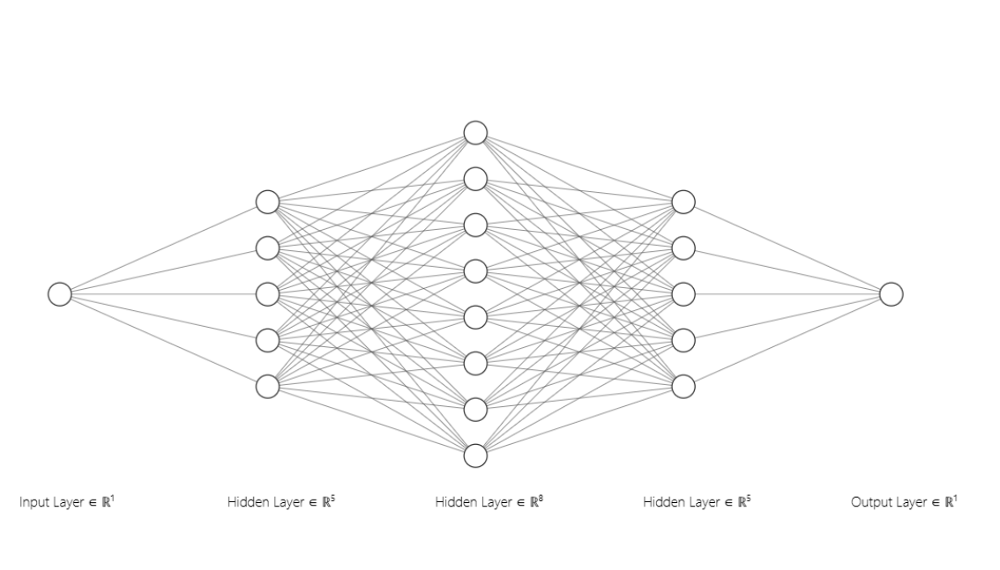
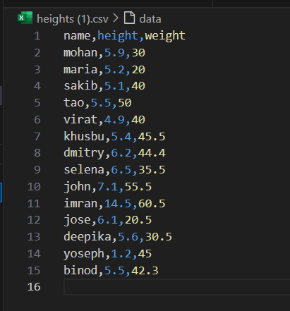

# Developing a Neural Network Regression Model

## AIM:

To develop a neural network regression model for the given dataset.

## THEORY:

The given problem is a **regression problem**, where the objective is to predict a continuous target variable (weight) based on an input feature (height). Unlike classification, which predicts discrete categories, regression aims to find a relationship between input variables and continuous output values.

A **neural network regression model** is an artificial neural network that maps input data to continuous output. It consists of:

* **Input layer:** Receives the feature(s) (in this case, height).
* **Hidden layers:** Contain neurons that perform transformations using weighted connections, activation functions (like ReLU), and bias terms to learn complex, non-linear relationships.
* **Output layer:** Produces a continuous value (predicted weight).

### Key Concepts:

1. **Data Preprocessing:**

   * The dataset is split into **training** and **testing** sets to train and evaluate the model.
   * **MinMaxScaler** is applied to scale features between 0 and 1, ensuring stable training and faster convergence.

2. **Neural Network Model:**

   * Multiple fully connected (dense) layers are used.
   * **ReLU (Rectified Linear Unit)** activation introduces non-linearity, enabling the model to learn complex patterns.
   * The final layer has a single neuron (since the output is one continuous value).

3. **Loss Function:**

   * **Mean Squared Error (MSE)** is used as the loss function to measure the difference between actual and predicted weights.
   * Lower MSE indicates better performance.

4. **Optimizer:**

   * **RMSProp** optimizer is applied to update weights and minimize loss during backpropagation.

5. **Training Process:**

   * Forward pass computes predictions.
   * Backward pass updates weights based on the gradient of the loss function.
   * Training continues for multiple epochs until the model converges.

6. **Model Evaluation:**

   * The model’s performance is tested on unseen data (test set).
   * A **loss vs. epoch plot** shows how the model improves over time.
   * The trained model can also predict new, unseen inputs.


## Neural Network Model:



## DESIGN STEPS:

### STEP 1:

Loading the dataset.

### STEP 2:

Split the dataset into training and testing.

### STEP 3:

Create MinMaxScalar objects ,fit the model and transform the data.

### STEP 4:

Build the Neural Network Model and compile the model.

### STEP 5:

Train the model with the training data.

### STEP 6:

Plot the performance plot.

### STEP 7:

Evaluate the model with the testing data.

## PROGRAM
### Name: VENKATANATHAN P R
### Register Number: 212223240173
```python
import torch
import torch.nn as nn
import torch.optim as optim
import pandas as pd
from sklearn.model_selection import train_test_split
from sklearn.preprocessing import MinMaxScaler

dataset1 = pd.read_csv('heights (1).csv')
X = dataset1[['height']].values
y = dataset1[['weight']].values

X_train, X_test, y_train, y_test = train_test_split(X, y, test_size=0.33, random_state=33)

scaler = MinMaxScaler()
X_train = scaler.fit_transform(X_train)
X_test = scaler.transform(X_test)

X_train_tensor = torch.tensor(X_train, dtype=torch.float32)
y_train_tensor = torch.tensor(y_train, dtype=torch.float32).view(-1, 1)
X_test_tensor = torch.tensor(X_test, dtype=torch.float32)
y_test_tensor = torch.tensor(y_test, dtype=torch.float32).view(-1, 1)

class NeuralNet(nn.Module):
  def __init__(self):
    super().__init__()
    self.fc1=nn.Linear(1,8)
    self.fc2=nn.Linear(8,10)
    self.fc3=nn.Linear(10,1)
    self.relu=nn.ReLU()
    self.history = {'loss':[]}

  def forward(self,x):
    x=self.relu(self.fc1(x))
    x=self.relu(self.fc2(x))
    x=self.fc3(x)
    return x

# Initialize the Model, Loss Function, and Optimizer

Venkatanathan=NeuralNet()
criterion=nn.MSELoss()
optimizer=torch.optim.RMSprop(Venkatanathan.parameters(),lr=0.001)

def train_model(Venkatanathan,X_train,y_train,criterion,optimizer,epochs=1000):
  for epoch in range(epochs):
    optimizer.zero_grad()
    loss=criterion(Venkatanathan(X_train),y_train)
    loss.backward()
    optimizer.step()

    Venkatanathan.history['loss'].append(loss.item())
    if epoch % 200==0:
      print(f'Epoch [{epoch}/{epochs}], Loss: {loss.item():.6f}')

train_model(Venkatanathan, X_train_tensor, y_train_tensor, criterion, optimizer)

with torch.no_grad():
    test_loss = criterion(Venkatanathan(X_test_tensor), y_test_tensor)
    print(f'Test Loss: {test_loss.item():.6f}')

loss_df = pd.DataFrame(Venkatanathan.history)

import matplotlib.pyplot as plt
loss_df.plot()
plt.xlabel("Epochs")
plt.ylabel("Loss")
plt.title("Loss during Training")
plt.show()

X_n1_1 = torch.tensor([[5.5]], dtype=torch.float32)
prediction = Venkatanathan(torch.tensor(scaler.transform(X_n1_1), dtype=torch.float32)).item()
print(f'Prediction: {prediction}')
```
## Dataset Information



## OUTPUT

### Training Loss Vs Iteration Plot


### New Sample Data Prediction


## RESULT

The program to develop a neural network regression model for the given dataset has been successfully executed.

